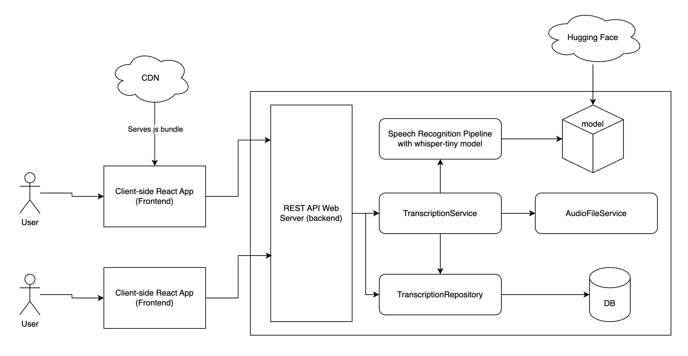

# Audio Transcription Service

This is an audio transcription application which allows users to upload one or more audio files via a web UI, to receive transcription of their audio files. Users can also browse previously transcribed audio by searching by file name.

The application is served as a single-page-application (SPA) frontend web application connected to a RESTful backend API performs the inference task and stores transcriptions in a database.

In production, the frontend and backend can ideally be deployed separately. The frontend can be built and served via a CDN - the benefit of using a SPA framework - as this will be more cost effective. The backend API needs to be hosted on a server, that can be exposed via HTTPS. For this reason, a docker-compose build was not prepared, but separate dockerfiles were written for the frontend and backend respectively.

To run the frontend and backend docker builds, or to run locally, refer to the respective documentation:

- [Frontend](frontend/README.md)
- [Backend](backend/README.md)

The frontend is built on React + Vite as a SPA, providing a richer interactive user experience than the traditional (obsolete) server rendered pages. There is no requirement for SEO-optimization, therefore SPA is more suitable compared to Server Side Generation (SSG) / Server Side Rendering (SSR) / React Server Component (RSC) frameworks. The frontend communicated with the backend via HTTP/HTTPS requests, passing data in JSON format (the files are submitted using form data).

The backend API is build with FastAPI Python framework. The rich Python ecosystem gave us the benefit of libraries like Hugging Face's "transformers", which gives us convenient wrapper like "Pipeline" to run inference on pretrained models.

The backend system is represented by the right half of the diagram. On initial spin up of the backend server for the first time, the whisper-tiny model will be pulled from Hugging Face and downloaded to the server (or your local computer if running locally). The lag time should be factored in deployment planning if the app will be spin up in new/different compute instance frequently, and if cold start is a concern for the use case.

The application access the model via the "Speech Recognition Pipeline" component, which wraps Hugging Face's pipeline for running inference. The application also access the database via the TranscriptionRepository. The database is currently SQLite file stored in the same compute as the backend server. This may not be scalable in the long run and we can look into provisioning the database on its own compute or using managed database hosting solutions when the need to scale arises.

TranscriptionService and TranscriptionRepository components are provisioned via FastAPI dependency injection system. The "Speech Recognition Pipeline" was NOT placed with the dependency injection system + lru_cache as it would mean the model would be loaded on the first request. Instead, we load the model in FastAPI lifespan. AudioFileService has lifetime scope of a request and therefore not provided through dependency injection.

When the scaling needs arise, we can look into improving the robustness of the architecture. We can consider caching, rate limiting, running inference in parallel, running inference as a background job, and replicating the database to provide more read replicas or instead shard the database by users.

Alternatively, there is growing development in local-first software with advancement of personal device hardware specs. It could be imaginable to run inference on user's local device instead. We can look into leveraging WebAssembly and/or WebGL to run the compute locally. This would save compute and simplify the architecture. Simple is good. Inference data can be stored locally as well, with IndexedDB in the browser, or SQLite for mobile devices.

With the two opposite general directions for the architecture, which path to take depends on the use cases and the use case evolves.
